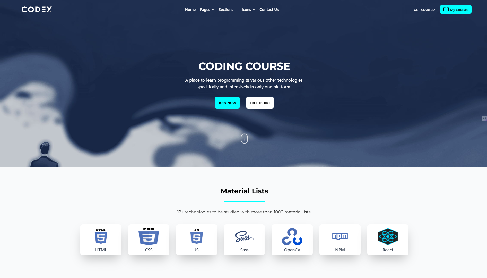
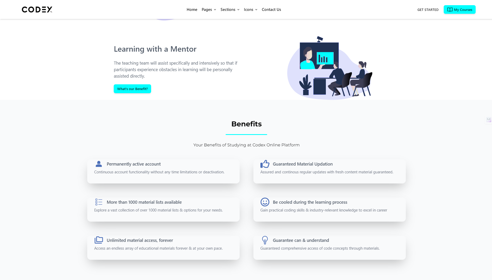
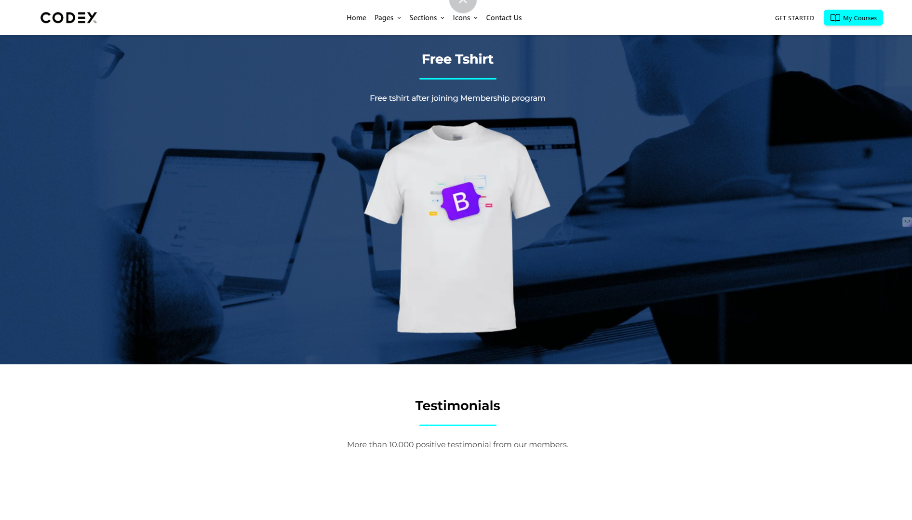
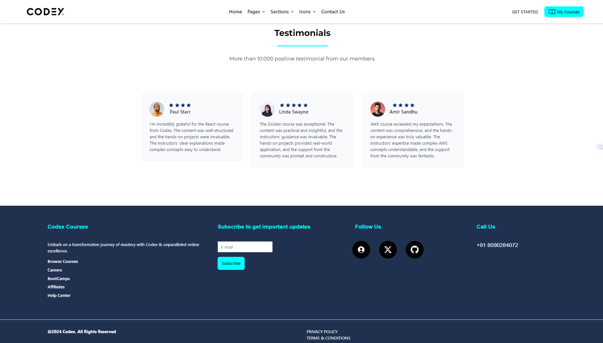

# 🎓 **Codex: A Coding Course Platform**  

### 🌟 *Empowering aspiring developers with cutting-edge learning coding resources with an elegant user experience.*  

---

## 🌐 **Live Website**  
> [Check out Codex here!](https://cod-ex.netlify.app/)  

---

## 📖 **Table of Contents**  
1. [Introduction](#introduction)  
2. [Features](#features)  
3. [Tech Stack](#tech-stack)
4. [Demo & Live Images](#demo--live-images)  
5. [Project Structure](#project-structure)  
6. [Setup Instructions](#setup-instructions)  
7. [Future Enhancements](#future-enhancements)  
8. [License](#license)  
9. [Contact](#contact)  

---

## 💡 **Introduction**  

**Codex** is a sleek, animated, and highly responsive landing page for a coding course platform.  
Designed to captivate users, the website seamlessly combines powerful animations with modern design aesthetics, ensuring an engaging experience for visitors. Built with scalability and performance in mind, Codex exemplifies the possibilities of modern web development.

---

## ✨ **Features**  
- ⚡ **Smooth Animations** powered by `data-aos` for seamless transitions.  
- 🎨 **Custom Styling** with `styled-components` for reusable and dynamic designs.  
- 📱 **Responsive Design** ensuring compatibility across devices and screen sizes.  
- 🚀 **Optimized Performance** using Vite's blazing-fast build tool.  
- 🌌 **Interactive UI/UX** leveraging React.js components and TailwindCSS for modularity.  

---

## 🛠️ **Tech Stack**  

| **Technology**      | **Usage**                                           |  
|----------------------|-----------------------------------------------------|  
| **React.js**         | Core library for building UI components.           |  
| **TailwindCSS**      | Utility-first CSS framework for responsive styling. |  
| **Vite**             | Fast build and dev server for React.               |  
| **data-aos**         | Animation library for on-scroll animations.        |  
| **Styled Components**| Custom component-level styling.                    |  

---

## 📸 **Demo & Live Images**  

### Landing Page Highlights:  
#### Hero Section:  


#### Features Overview:  



#### Footer:  


(*Replace the placeholder links with actual image URLs from your project*)  

---

## 📁 **Project Structure**  

The folder hierarchy is organized for scalability and maintainability:  

```plaintext
Codex/
├── src/
│   ├── components/       # Reusable UI components  
│   ├── styles/           # Tailwind and styled-components CSS  
│   ├── App.jsx           # Root React Component  
│   ├── main.jsx          # Entry point  
│   ├── assets/           # Images and static assets  
├── public/               # Public files and HTML  
├── .gitignore            # Git ignored files  
├── package.json          # Dependencies and scripts  
├── vite.config.js        # Vite configuration  
├── README.md             # Documentation  
```

---

## 🛠️ **Setup Instructions**  

Follow these steps to clone and run **Codex** locally:  

### Prerequisites:  
- **Node.js** installed (v16 or higher recommended).  

### Steps:  

1. **Clone the Repository:**  
   ```bash  
   git clone https://github.com/Hailex798/Codex.git  
   cd Codex  
   ```  

2. **Install Dependencies:**  
   ```bash  
   npm install  
   ```  

3. **Run the Development Server:**  
   ```bash  
   npm run dev  
   ```  

4. **View Locally:**  
   Open your browser and navigate to:  
   ```
   http://localhost:5173  
   ```  

---

## 🚀 **Future Enhancements**  

- Add a fully functional **authentication flow** for student enrollment.  
- Integrate a **backend API** for dynamic content.  
- Implement **payment gateway support** for course purchases.  
- Optimize SEO for broader reach.  

---

## 📜 **License**  

This project is licensed under the **MIT License**. You are free to modify and use the project for personal or commercial purposes.  

---

## ✉️ **Contact**  

If you have questions, feedback, or collaboration ideas, feel free to reach out!  

- **Email**: [kshitijsinghbisht777@gmail.com](mailto:kshitijsinghbisht777@gmail.com)
- **GitHub**: [Hailex798](https://github.com/hailex798)
- **LinkedIn**: [Kshitij Singh Bisht](https://linkedin.com/in/kshitijsinghbisht)
- **Portfolio**: [Kshitij Singh Bisht](https://kshitijsinghbisht.netlify.app)

---

> *Crafted with 💻 and ☕ by [Kshitij Singh Bisht](https://kshitijsinghbisht.netlify.app)*  

